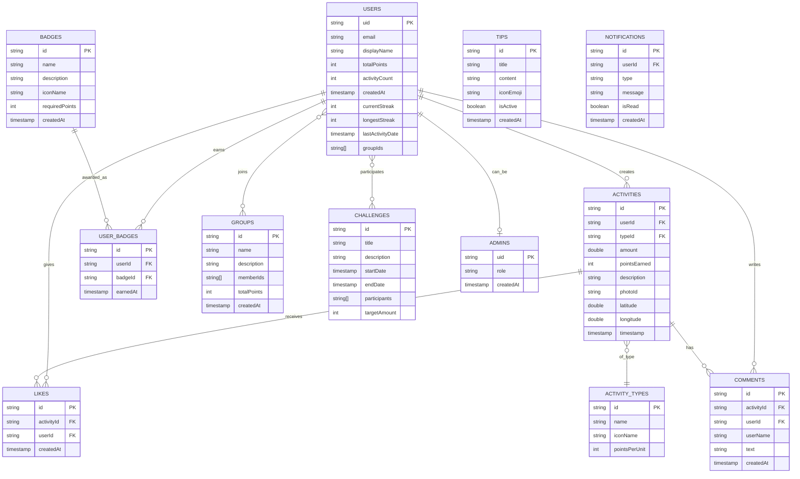

# EcoTrack Database - ER Diagram (Mermaid)

## Tablo Açıklamaları

### 1. USERS (Kullanıcılar)
- **Amaç:** Tüm kullanıcı bilgilerini tutar
- **Önemli:** Streak (ardışık gün) bilgileri de burada
- **İlişkiler:** Tüm aktivitelerin, yorumların, beğenilerin sahibi

### 2. ADMINS (Yöneticiler)
- **Amaç:** Admin yetkilerine sahip kullanıcıları tanımlar
- **Özellik:** Rol bazlı yetkilendirme (role: "admin", "super_admin")
- **İlişki:** Bir kullanıcı admin olabilir (opsiyonel)
- **Kullanım:** Admin panelinde kullanıcı ve gönderi yönetimi

### 3. ACTIVITIES (Aktiviteler)
- **Amaç:** Kullanıcıların gerçekleştirdiği eko aktiviteleri
- **Native Özellik:** GPS konumu (latitude/longitude) ve kamera (photoId)
- **İlişkiler:** Bir kullanıcıya ve bir aktivite tipine ait

### 4. ACTIVITY_TYPES (Aktivite Tipleri)
- **Amaç:** Plastik toplama, ağaç dikimi, cam geri dönüşüm gibi tipler
- **Özellik:** Her tip için puan hesaplama (pointsPerUnit)

### 5. BADGES (Rozetler)
- **Amaç:** Başarı rozetleri tanımı
- **Gamification:** Kullanıcı motivasyonu için

### 6. USER_BADGES (Kullanıcı Rozetleri)
- **Amaç:** Hangi kullanıcının hangi rozeti kazandığını takip
- **İlişki Tablosu:** USERS ↔ BADGES many-to-many ilişkisi

### 7. GROUPS (Topluluklar)
- **Amaç:** Kullanıcı grupları/topluluklar
- **Özellik:** Grup toplam puanı ve üye listesi

### 8. LIKES (Beğeniler)
- **Amaç:** Aktivitelere yapılan beğeniler
- **İlişki:** Bir kullanıcı bir aktiviteyi beğenir

### 9. COMMENTS (Yorumlar)
- **Amaç:** Aktivitelere yapılan yorumlar
- **Özellik:** Kullanıcılar kendi yorumlarını silebilir

### 10. CHALLENGES (Meydan Okumalar)
- **Amaç:** Zaman sınırlı toplu görevler
- **Özellik:** Başlangıç/bitiş tarihi ve katılımcılar

### 11. TIPS (İpuçları)
- **Amaç:** Günlük çevre ipuçları
- **Özellik:** Aktif/pasif durumu (isActive)

### 12. NOTIFICATIONS (Bildirimler)
- **Amaç:** Kullanıcı bildirimleri
- **Özellik:** Okundu/okunmadı durumu

## Normalizasyon
- ✅ 1NF: Tüm alanlar atomic değerler içerir
- ✅ 2NF: Primary key'e bağımlılık sağlanmış
- ✅ 3NF: Transitif bağımlılık yok
- ✅ İlişki tabloları kullanılmış (USER_BADGES)
- ✅ Foreign Key referansları tanımlı

## Native Modüller
- 📷 **Kamera:** ACTIVITIES tablosunda `photoId` alanı
- 📍 **GPS/Harita:** ACTIVITIES tablosunda `latitude` ve `longitude` alanları
