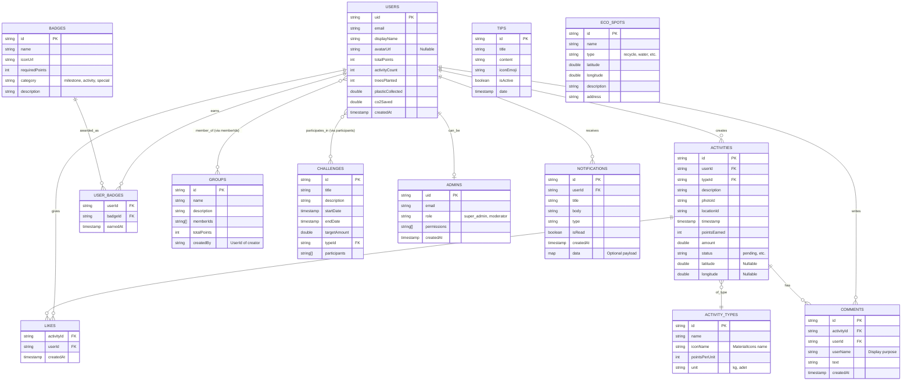

# EcoTrack Database - ER Diagram (Mermaid)

> [!NOTE]
> This schema is auto-generated based on the actual `lib/models/*.dart` files in the project.

## Tablo Detayları (Codebase Analizi)

### 1. USERS (`UserModel`)
- **Dosya:** `lib/models/user_model.dart`
- **Alanlar:** `uid`, `email`, `displayName`, `avatarUrl`, `totalPoints`, `activityCount`, `plasticCollected`, `treesPlanted`, `co2Saved`, `createdAt`.
- **Not:** Kod içerisinde `photoUrl` yerine `avatarUrl` kullanılmaktadır.

### 2. GROUPS (`Group`)
- **Dosya:** `lib/models/group_model.dart`
- **Alanlar:** `id`, `name`, `description`, `memberIds`, `totalPoints`, `createdBy`.
- **Not:** Grup kurucusu `creatorId` değil `createdBy` alanında tutulmaktadır.

### 3. ACTIVITIES (`Activity`)
- **Dosya:** `lib/models/activity_model.dart`
- **Alanlar:** `id`, `userId`, `typeId`, `description`, `photoId`, `locationId`, `pointsEarned`, `amount`, `status`, `latitude`, `longitude`, `timestamp`.
- **Not:** Konum verisi hem `locationId` referansı hem de direkt `latitude`/`longitude` olarak tutulabilmektedir.

### 4. COMMENTS (`Comment`)
- **Dosya:** `lib/models/comment_model.dart`
- **Alanlar:** `id`, `activityId`, `userId`, `userName`, `text`, `createdAt`.
- **Not:** Kullanıcı profil fotoğrafı (`userPhotoUrl`) modelde **yoktur**. Sadece `userName` önbelleklenmektedir.

### 5. BADGES (`BadgeModel`)
- **Dosya:** `lib/models/badge_model.dart`
- **Alanlar:** `id`, `name`, `iconUrl`, `requiredPoints`, `category`, `description`.

### 6. ECO_SPOTS (`EcoSpot`)
- **Dosya:** `lib/models/eco_spot_model.dart`
- **Özellik:** Geri dönüşüm noktaları, şarj istasyonları vb. harita noktaları.
- **Alanlar:** `id`, `name`, `type`, `latitude`, `longitude`, `description`, `address`.

### 7. CHALLENGES (`Challenge`)
- **Dosya:** `lib/models/challenge_model.dart`
- **Alanlar:** `id`, `title`, `description`, `startDate`, `endDate`, `targetAmount`, `typeId`, `participants`.

### 8. ACTIVITY_TYPES (`ActivityType`)
- **Dosya:** `lib/models/activity_type_model.dart`
- **Alanlar:** `id`, `name`, `iconName`, `pointsPerUnit`, `unit`.

### 9. TIPS (`TipModel`)
- **Dosya:** `lib/models/tip_model.dart`
- **Alanlar:** `id`, `title`, `content`, `iconEmoji`, `isActive`, `date`.

### 10. NOTIFICATIONS (`NotificationModel`)
- **Dosya:** `lib/models/notification_model.dart`
- **Alanlar:** `id`, `userId`, `title`, `body`, `type`, `isRead`, `createdAt`, `data`.

### 11. ADMINS (`AdminModel`)
- **Dosya:** `lib/models/admin_model.dart`
- **Alanlar:** `uid`, `email`, `role`, `permissions`, `createdAt`.

### 12. LIKES (`Like`)
- **Dosya:** `lib/models/like_model.dart`
- **Alanlar:** `activityId`, `userId`, `createdAt`.

### 13. USER_BADGES (`UserBadge`)
- **Dosya:** `lib/models/user_badge_model.dart`
- **Alanlar:** `userId`, `badgeId`, `earnedAt`.
- **İlişkiler:** `USERS` (linked), `BADGES` (linked).

## Normalizasyon Analizi
- **1NF (Atomic Değerler):** Tüm alanlar atomik değerler içermektedir. Array alanlar (`memberIds`, `participants`) Firestore/NoSQL yapısına uygundur ve sorgulama kolaylığı sağlar.
- **2NF (Kısmi Bağımlılık Yok):** Tüm tabloların primary key'i (id/uid) belirlidir ve alanlar tam bağımlıdır.
- **3NF (Transitif Bağımlılık Yok):** Veri tekrarından kaçınılmıştır. Örn: Kullanıcı detayları `USERS` tablosunda tutulup diğer tablolarda sadece `userId` olarak referans gösterilmiştir. `COMMENTS` tablosundaki `userName` gibi istisnalar okuma performansını artırmak (denormalizasyon) amacıyla bilinçli yapılmıştır.

## Native Modüller ve Kullanımı
Bu veritabanı şeması aşağıdaki native cihaz özelliklerini destekler:
- 📷 **Kamera:** `ACTIVITIES` tablosundaki `photoId` alanı, `USERS` tablosundaki `avatarUrl` alanı.
- 📍 **GPS/Harita:** `ACTIVITIES` ve `ECO_SPOTS` tablolarındaki `latitude` ve `longitude` alanları.

